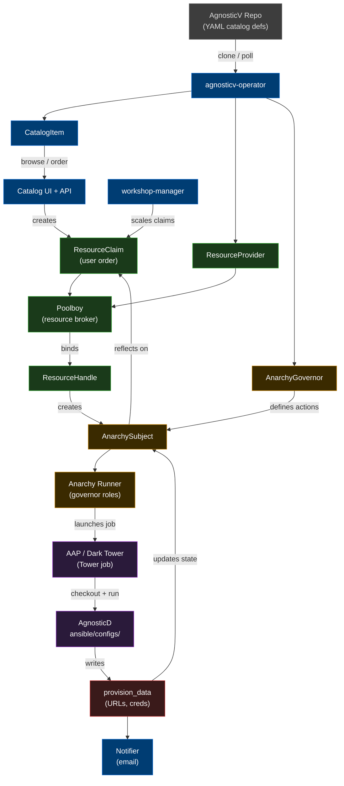

# Red Hat Demo Platform — Architecture Documentation

Architecture documentation for the Red Hat Demo Platform (RHDP / demo.redhat.com), covering Babylon, AgnosticD, AgnosticV, and all related Kubernetes operators.

---

## Interactive Architecture View

> **Full tabbed interactive view** — open [`archHtmlFormat/index.html`](archHtmlFormat/index.html) directly, or use the iframes below.
>
> **Note:** GitHub.com strips `<iframe>` tags from rendered markdown for security. To see the embedded views below, either:
> - Enable **GitHub Pages** on this repo (Settings → Pages → branch: `main`) — then view at `https://rhpds.github.io/myDemoPlatformDoc/`
> - Clone the repo and open `README.md` in VS Code / a local browser
> - Open any tab file directly: [Overview](archHtmlFormat/index.html) · [Components](archHtmlFormat/components.html) · [CRDs](archHtmlFormat/crds.html) · [Workflows](archHtmlFormat/workflows.html) · [Integration](archHtmlFormat/integration.html)

### Overview

<iframe src="archHtmlFormat/index.html" width="100%" height="620" frameborder="0" style="border:1px solid #333;border-radius:6px;background:#1e1e1e"></iframe>

### Components

<iframe src="archHtmlFormat/components.html" width="100%" height="620" frameborder="0" style="border:1px solid #333;border-radius:6px;background:#1e1e1e"></iframe>

### CRDs

<iframe src="archHtmlFormat/crds.html" width="100%" height="620" frameborder="0" style="border:1px solid #333;border-radius:6px;background:#1e1e1e"></iframe>

### Workflows

<iframe src="archHtmlFormat/workflows.html" width="100%" height="620" frameborder="0" style="border:1px solid #333;border-radius:6px;background:#1e1e1e"></iframe>

### Integration

<iframe src="archHtmlFormat/integration.html" width="100%" height="620" frameborder="0" style="border:1px solid #333;border-radius:6px;background:#1e1e1e"></iframe>

---

## Architecture Overview (GitHub native — always visible)

| Color | Layer | Systems |
|-------|-------|---------|
| Blue | Babylon | agnosticv-operator, Catalog UI + API, notifier, workshop-manager |
| Green | Poolboy (resource broker) | ResourceProvider, ResourceClaim, ResourceHandle, Poolboy |
| Orange | Anarchy (action engine) | AnarchyGovernor, AnarchySubject, Anarchy Runner |
| Purple | Execution | AAP / Dark Tower, AgnosticD |
| Red | Data feedback | provision_data |

---

## Contents

| File | Description |
|------|-------------|
| [archHtmlFormat/index.html](archHtmlFormat/index.html) | **Full tabbed interactive HTML** — all 5 sections in one page |
| [archHtmlFormat/overview.html](archHtmlFormat/overview.html) | Overview tab direct link |
| [archHtmlFormat/components.html](archHtmlFormat/components.html) | Components tab direct link |
| [archHtmlFormat/crds.html](archHtmlFormat/crds.html) | CRDs tab direct link |
| [archHtmlFormat/workflows.html](archHtmlFormat/workflows.html) | Workflows tab direct link |
| [archHtmlFormat/integration.html](archHtmlFormat/integration.html) | Integration tab direct link |
| [babylon-agnosticd-architecture.md](babylon-agnosticd-architecture.md) | Full architecture reference (markdown) |
| [operators-reference.md](operators-reference.md) | Per-operator reference card |
| [crd-reference.md](crd-reference.md) | All CRDs grouped by API group |
| [workflows.md](workflows.md) | Step-by-step lifecycle workflows |
| [babylon-agnosticd-architecture.canvas.tsx](babylon-agnosticd-architecture.canvas.tsx) | Interactive visual canvas (tabbed architecture view) |

---

## Quick mental model

| Layer | System | Analogy |
|-------|--------|---------|
| Catalog definition | AgnosticV (YAML) | Menu / recipe book |
| Order management | Babylon (Catalog UI + API) | Restaurant ordering system |
| Resource brokering | Poolboy (CRDs) | Table reservation / prep station |
| Action execution | Anarchy + babylon_anarchy_governor | Kitchen workflow engine |
| Job runner | AAP / Dark Tower | Kitchen appliances |
| Provisioner | AgnosticD (ansible/configs/) | Recipes being executed |
| Cloud accounts | Sandbox API | Pre-allocated ingredients |

## Knowledge Transfer Meeting Recording:
<iframe width="560" height="315" 
        src="[Babylon - OpenShift orchestration that powers RHDP - 2026/06/04 21:00 IST - Recording](https://drive.google.com/file/d/1rivmVOdPl3YyWMmxirVHEzX-dvQkjIiA/view)" 
        title="YouTube video player" 
        frameborder="0" 
        allow="accelerometer; autoplay; clipboard-write; encrypted-media; gyroscope; picture-in-picture; web-share" 
        allowfullscreen>
</iframe>
<iframe width="560" height="315" 
        src="[Babylon API and UI - 2026/06/24 20:04 IST - Recording](https://drive.google.com/file/d/1Spqdp8cgLvSUt1wFaAgiu-t2P0mxyteI/view)" 
        title="YouTube video player" 
        frameborder="0" 
        allow="accelerometer; autoplay; clipboard-write; encrypted-media; gyroscope; picture-in-picture; web-share" 
        allowfullscreen>
</iframe>
<iframe width="560" height="315" 
        src="[Babylon ArgoCD configuration and maintenance  - 2026/07/14 19:59 IST - Recording](https://drive.google.com/file/d/18HoaROQp1RdO-JVaQd1dLOb0zydqm5Tm/view)" 
        title="YouTube video player" 
        frameborder="0" 
        allow="accelerometer; autoplay; clipboard-write; encrypted-media; gyroscope; picture-in-picture; web-share" 
        allowfullscreen>
</iframe>
